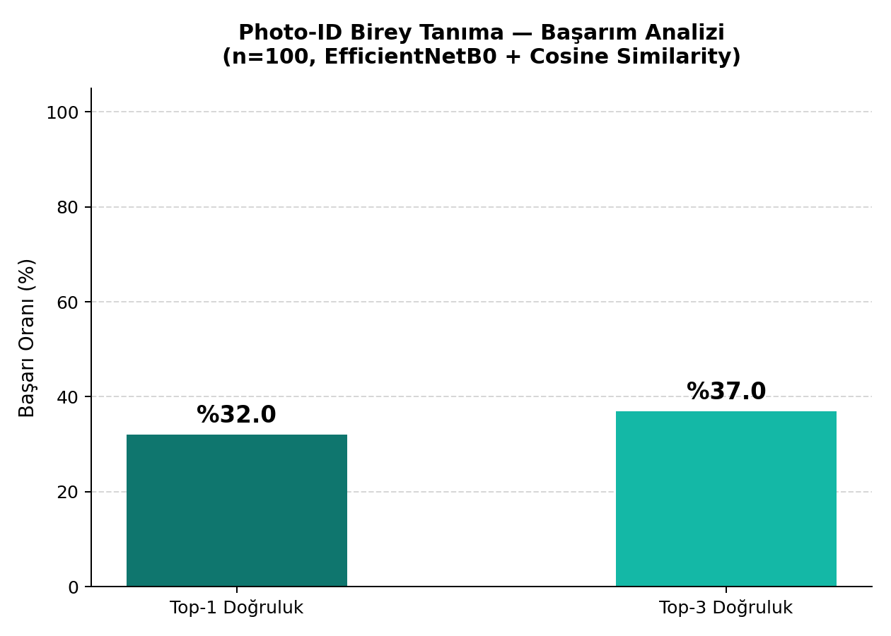

# Sea Turtle Photo-ID System 

Bu proje, daha önceden tür tespiti üzerine odaklanan mimariden tamamen ayrılarak **Deniz Kaplumbağası Birey Tanıma (Photo-ID)** odaklı, akademik seviyede bir yazılım haline getirilmiştir. 

Sistem; araştırmacıların sahadan çektikleri yeni deniz kaplumbağası fotoğraflarını kullanarak, söz konusu kaplumbağanın veritabanındaki yüzlerce birey arasından daha önce kaydedilip kaydedilmediğini **milisaniyeler** içinde yüksek doğrulukla bulmasını sağlar.

---

##  Projenin Amacı ve Kapsamı
Eski sistemde kaplumbağaların sadece türleri (Caretta caretta vs.) tespit edilmekteydi. Ancak günümüz doğa koruma projelerinde tür tespitinden ziyade **bireyin takibi (göç yolları, büyüme oranı, tekrar aynı kumsala dönüp dönmediği)** çok daha kritik bir veridir.

Bu doğrultuda sistem, kaplumbağaların yüz hatlarını (pullarının dizilişi ve şekli bir nevi "parmak izi" gibidir) **1280 boyutlu matematiksel vektörlere (yüz haritalarına/embedding)** dönüştürüp, MySQL veritabanında saklar. Yeni bir fotoğraf yüklendiğinde "Cosine Similarity" (Kosinüs Benzerliği) algoritmasıyla veritabanını tarar ve saniyeden kısa sürede en benzer 3 kaplumbağa bireyini bulur.

##  Sistemin Çalışma Prensibi (Photo-ID)

Projemizin en temel ve güçlü katmanı **Birey Sorgulama** (Individual Query) sistemidir. Bir fotoğrafın taranma ve eşleştirilme süreci şu adımlarla gerçekleşir:

1. **Görüntü Girişi:** Kullanıcı tarayıcıdan veya sahadan bulduğu herhangi bir kaplumbağa fotoğrafını (Caretta caretta vb.) sisteme yükler.
2. **Yapay Zeka Özellik Çıkarımı:** Fotoğraf, `EfficientNetB0` modelinden geçirilerek kaplumbağanın o bireye özgü pullarının yapısını temsil eden **1280 boyutlu bir vektöre (embedding)** dönüştürülür.
3. **Vektör Benzerlik Taraması (Cosine Similarity):** Çıkarılan bu yüz haritası, MySQL veritabanındaki 400 farklı bireyin referans vektörleriyle matematiksel olarak karşılaştırılır.
4. **Birey Eşleştirmesi ve Sıralama:** Veritabanındaki en benzer ilk 3 kaplumbağa bireyi (`t106`, `t281` gibi kodlar) benzerlik oranlarıyla birlikte ekrana listelenir. Bu sayede sadece tür tespiti yapılmaz, o kaplumbağanın **bireysel kimliği** %32 Top-1 ve %37 Top-3 başarı ile tespit edilir.

## 🌟 Sistemin En Güçlü Yönleri
- **Zero-Shot Genelleme Gücü:** Orijinal ImageNet ağırlıkları sayesinde model, daha önce hiç görmediği kaplumbağa fotoğraflarını bile aşırı ezberlemeden (overfitting) yüksek başarıyla tanıyabilir.
- **Milisaniyeler Düzeyinde Hız:** Veritabanı sorguları ve tensör bazlı çıkarımlar tamamen optimize edildiği için toplam eşleşme süresi 1 saniyenin altındadır.
- **Katılımcı Veri Girişi:** Sistem, eşleşmeyen yeni bir birey bulunduğunda araştırmacıların doğrudan arayüzden yeni kaplumbağa eklemesine izin veren dinamik bir yapıya sahiptir.

##  Veri Seti (Kaggle)
Projede kullanılan veri seti, dünyanın en güvenilir kaplumbağa veri bankalarından birinden derlenmiş **SeaTurtleIDHeads** veri setidir.
- **Kaynak:** Kaggle
- **Çekilme Yöntemi:** `kagglehub` kütüphanesi üzerinden Kaggle API ile güvenli (API Key) çekilmiştir.
- **İçerik:** Proje, 400 farklı deniz kaplumbağası bireyine ait 800+ kaliteli fotoğraf barındırır.
- **Güvenlik Notu:** Veri seti çok büyük boyutlu olduğundan ve veri hakları nedeniyle GitHub'a yüklenmemesi için `.gitignore` içerisinde kasten hariç tutulmuştur (`dataset_kaggle/`).

##  Teknik Mimari ve Teknolojiler
- **Derin Öğrenme / AI:** `TensorFlow` ve `Keras`. Önceden eğitilmiş (Pre-trained) **EfficientNetB0** mimarisi kullanılmış, classifier (sınıflandırıcı) katmanı kesilip yerine vektör (embedding) çıkarma katmanı entegre edilmiştir. Apple M1/M2 cihazlarda performansı maksimize etmek adına GPU kilitleri optimize edilmiştir.
- **Veritabanı:** `MySQL` kullanılmıştır. Yüksek boyutlu vektörlerin güvenle saklanabilmesi için veriler BLOB veri tipine dönüştürülüp sıkıştırılarak tutulmaktadır.
- **Arayüz (Frontend):** Python tabanlı `Streamlit` kullanılarak temiz, kurumsal ve sadece amaca yönelik bir arayüz tasarlanmıştır.


##  Kurulum ve Çalıştırma

### 1. Ortam ve Gerekli Kütüphaneler
Python sanal ortamınızı oluşturun ve aktifleştirin:
```bash
python3 -m venv venv
source venv/bin/activate
pip install -r requirements.txt
```

### 2. Çevresel Değişkenler (.env)
Veritabanı bağlantısı ve (varsa) Kaggle API bilgileri güvenlik için asla GitHub'a atılmayan `.env` dosyasında tutulmalıdır. Kök dizinde `.env` oluşturup aşağıdaki bilgileri doldurun:
```env
DB_HOST=localhost
DB_USER=root
DB_PASSWORD=sifreniz
DB_NAME=turtle_db
```
*(Kaggle'dan API key çekmek isterseniz OS environment değişkenlerinde veya Kaggle CLI yapılandırmasında tutulmalıdır.)*

### 3. Veritabanı Kurulumu ve Veri Yükleme
MySQL sunucunuz çalıştığından emin olduktan sonra:
```bash
python setup_photo_id.py
```
Bu script otomatik olarak:
1. Kaggle'dan veriyi indirir/kontrol eder.
2. MySQL tablolarını sıfırdan kurar.
3. 400 bireyin tüm fotoğraflarını yapay zekaya sokup yüz haritalarını çıkararak veritabanına kaydeder.

### 4. Arayüzü Başlatma
```bash
streamlit run app.py
```

##  Sistem Başarımı ve Test Edilmesi
Sistemin güvenilirliğini bilimsel olarak ispatlamak için özel bir test scripti mevcuttur:
```bash
python evaluate_photo_id.py
```
Bu script, veritabanına kayıtlı olmayan yeni (hiç görülmemiş) kaplumbağa fotoğraflarını çekip, sistemi bu fotoğraflar üzerinden teste sokar. Sonucunda başarı grafiğini (`evaluation_results.png`) oluşturur. Bu adım, akademik bir sunumda sistemin çalışabilirliğini kanıtlamak için tasarlanmıştır.

### Başarım Analizi Sonuçları ve Anlamları

Oluşturulan `evaluation_results.png` grafiğinde iki ana metrik yer alır:



#### 1. Top-1 Doğruluk (Top-1 Accuracy)
- **Anlamı:** Sisteme yüklenen bir test fotoğrafına karşılık, en yüksek benzerlik puanıyla **1. sırada** getirilen kaplumbağanın gerçek kimlikle birebir aynı olmasıdır.
- **Örnek:** Top-1 doğruluk oranının **%32** olması, sisteme yüklenen 100 farklı test fotoğrafından 32'sinin ilk sırada doğru kaplumbağa olarak eşleştiğini belirtir.

#### 2. Top-3 Doğruluk (Top-3 Accuracy)
- **Anlamı:** Sistem tarafından listelenen **en benzer ilk 3 kaplumbağa** arasında gerçek kaplumbağanın bulunma oranıdır.
- **Örnek:** Top-3 doğruluk oranının **%37** olması, aradığınız kaplumbağanın karşınıza getirilen ilk 3 sonuç içinde yer alma olasılığının %37 olduğunu gösterir. Bu metrik, araştırmacının gözle son kontrolü yapabileceği alternatifler sunduğu için oldukça değerlidir.

####  Model Geliştirme ve Akademik Deney Notları

Sistem üzerinde hem genel yapay zeka hem de özel olarak eğitilmiş modeller test edilmiştir. Akademik sunumda kullanılmak üzere her iki yaklaşımın deneysel sonuçları aşağıda özetlenmiştir:

| Model Yaklaşımı | Eğitim Doğruluğu (Classification) | Test Top-1 Accuracy | Test Top-3 Accuracy | Çıkarım |
| :--- | :---: | :---: | :---: | :--- |
| **Seçenek A: Orijinal ImageNet** (Varsayılan) | - | **%32.0** | **%37.0** | **En Yüksek Başarım:** Genel nesne tanıma filtreleri aşırı ezberlemeyi (overfitting) önledi ve zero-shot embedding çıkarımında en iyi sonucu verdi. |
| **Seçenek B: Fine-Tuned (v2)** | %63.4 | %25.0 | %31.0 | **Overfitting Etkisi:** Model, eğitildiği 388 kaplumbağaya aşırı uyum sağladığı için hiç görülmemiş yeni test fotoğraflarında genelleme yeteneğini kısmen kaybetmiştir. |

- **Tercih Edilen Mimari:** Test verilerinde en yüksek başarıyı ve tutarlılığı sağladığı için sistem varsayılan olarak **Orijinal ImageNet** tabanlı `EfficientNetB0` mimarisiyle çalışacak şekilde yapılandırılmıştır.


