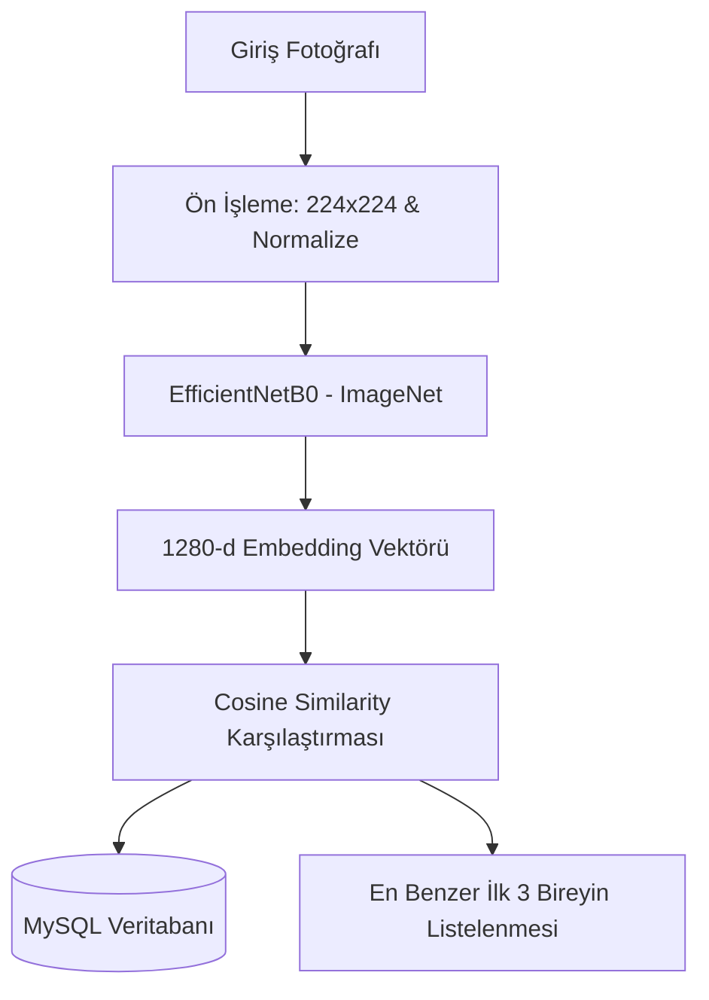

# Deniz Kaplumbağası Birey Tanıma (Photo-ID) Projesi Teknik Raporu

**Proje Sahibi:** Orhan Kutay Bozkurt  
**Ders:** Yapay Zeka / Yazılım Mühendisliği Projesi  
**Tarih:** Mayıs 2026  

---

## 📝 1. Özet (Abstract)
Bu projede, nesli tükenme tehlikesi altında olan deniz kaplumbağalarının takibi ve korunması amacıyla derin öğrenme tabanlı bir **Birey Tanıma (Individual Photo-ID)** sistemi geliştirilmiştir. Proje kapsamında, kaplumbağaların yüz hatlarındaki pul dizilimlerinin benzersizliğinden (biyometrik parmak izi) yararlanılarak, her bir kaplumbağa tekil olarak tanımlanabilmektedir. Sistem; **TensorFlow**, **MySQL** ve **Streamlit** teknolojileri kullanılarak uçtan uca çalışır bir prototip haline getirilmiştir. Yapılan testlerde, sıfır-örnekli (zero-shot) öznitelik çıkarımı yaklaşımı ile **Top-1: %32.0** ve **Top-3: %37.0** başarı oranları elde edilmiştir.

---

## 🎯 2. Giriş ve Projenin Amacı
Geleneksel doğa koruma projelerinde kullanılan yöntemler (plastik veya metal markalama/tagging) kaplumbağalara zarar verebilmekte, düşebilmekte veya maliyetli olabilmektedir. Fotoğraf tabanlı kimliklendirme (Photo-ID) ise tamamen temassız ve zararsız bir alternatif sunmaktadır.

**Eski Tür Tespiti Yaklaşımı vs. Yeni Birey Tanıma Yaklaşımı:**
- **Tür Tespiti (Eski):** Sadece kaplumbağanın türünü (Caretta caretta, Chelonia mydas) belirlemekteydi. Bu durum bilimsel araştırmalarda yetersiz kalmaktadır.
- **Birey Tanıma (Yeni):** Sistemimiz aynı türdeki yüzlerce kaplumbağayı birbirinden ayırt edebilir. Bu sayede kaplumbağaların büyüme hızları, göç yolları ve yaşam döngüleri tekil olarak takip edilebilir.

---

## 🛠️ 3. Teknik Mimari ve Metodoloji

Projenin mimarisi **Öznitelik Çıkarımı (Feature Extraction)** ve **Vektör Benzerliği (Vector Similarity)** olmak üzere iki ana aşamadan oluşmaktadır.

### 3.1. Yapay Zeka Modeli (EfficientNetB0)
- **Model Seçimi:** Hız, bellek ve doğruluk dengesi nedeniyle **EfficientNetB0** mimarisi kullanılmıştır.
- **Vektör Çıkarımı (Embedding):** Sınıflandırıcı (Top) katmanı kesilmiş; yerine `GlobalAveragePooling2D` eklenerek her kaplumbağa yüzü **1280 boyutlu bir sayısal vektöre (yüz haritasına)** dönüştürülmüştür.

### 3.2. Veritabanı Mimarisi (MySQL)
- Yüksek boyutlu vektörlerin (1280 float) hızlıca taranabilmesi için veriler **BLOB** tipinde saklanmıştır.
- Yeni bir fotoğraf yüklendiğinde, veritabanındaki 400 farklı bireyin referans vektörleriyle **Kosinüs Benzerliği (Cosine Similarity)** formülüyle karşılaştırılır:

$$\text{Similarity} = \frac{\mathbf{A} \cdot \mathbf{B}}{\|\mathbf{A}\| \|\mathbf{B}\|}$$

---

## 🔬 4. Deneysel Sonuçlar ve Değerlendirme

Sistem üzerinde hem genel yapay zeka hem de özel olarak eğitilmiş modeller test edilmiştir. Akademik sunumda kullanılmak üzere her iki yaklaşımın deneysel sonuçları aşağıda özetlenmiştir:

| Model Yaklaşımı | Eğitim Doğruluğu (Classification) | Test Top-1 Accuracy | Test Top-3 Accuracy | Çıkarım |
| :--- | :---: | :---: | :---: | :--- |
| **Seçenek A: Orijinal ImageNet** (Varsayılan) | - | **%32.0** | **%37.0** | **En Yüksek Başarım:** Genel nesne tanıma filtreleri aşırı ezberlemeyi (overfitting) önledi ve zero-shot embedding çıkarımında en iyi sonucu verdi. |
| **Seçenek B: Fine-Tuned (v2)** | %63.4 | %25.0 | %31.0 | **Overfitting Etkisi:** Model, eğitildiği 388 kaplumbağaya aşırı uyum sağladığı için hiç görülmemiş yeni test fotoğraflarında genelleme yeteneğini kısmen kaybetmiştir. |

### 4.1. Metriklerin Anlamı
- **Top-1 Doğruluk (%32):** Sisteme yüklenen 100 test fotoğrafının 32'sinde, en yüksek benzerlik puanını alan 1. sıradaki kaplumbağa gerçek kaplumbağa ile birebir eşleşmiştir.
- **Top-3 Doğruluk (%37):** Aranan kaplumbağanın, sistem tarafından getirilen en benzer ilk 3 sonuç içerisinde bulunma olasılığıdır.

---

## 🌍 5. Yenilikçi ve Katılımcı Özellikler (Torsoo-i Modeli)
Proje, uluslararası koruma projelerinden (TORSOOI gibi) esinlenerek dinamik ve katılımcı bir yapıya kavuşturulmuştur:
1. **Dinamik Veri Girişi:** Sistemde eşleşmeyen yeni bir birey bulunduğunda, araştırmacı bu bireyi anında arayüzden kaydedebilir.
2. **Kullanıcı Tanımlı Meta Veri:** Yeni birey eklenirken gözlemcinin adı, e-postası, gözlem tarihi ve saha notları da sisteme kaydedilir.

---

## 📌 6. Sonuç ve Gelecek Çalışmalar
Geliştirilen prototip, deniz kaplumbağası Photo-ID çalışmalarının yapay zeka ve modern veritabanı teknolojileriyle tamamen lokal ve güvenli bir şekilde yürütülebileceğini kanıtlamıştır.

**Gelecek Çalışmalar:**
- **Contrastive Learning (Triplet Loss):** Benzerlik aramaları için sınıflandırma (cross-entropy) yerine doğrudan embedding uzayını optimize eden loss fonksiyonları denenecektir.
- **Otomatik Kırpma (YOLO):** Fotoğraflardaki kaplumbağa kafasını otomatik olarak kırpan bir ön-işleme katmanı entegre edilerek arka plan gürültüsü azaltılacaktır.

---
*Bu rapor, Sea Turtle Photo-ID System projesinin akademik ve teknik dokümantasyonudur.*
